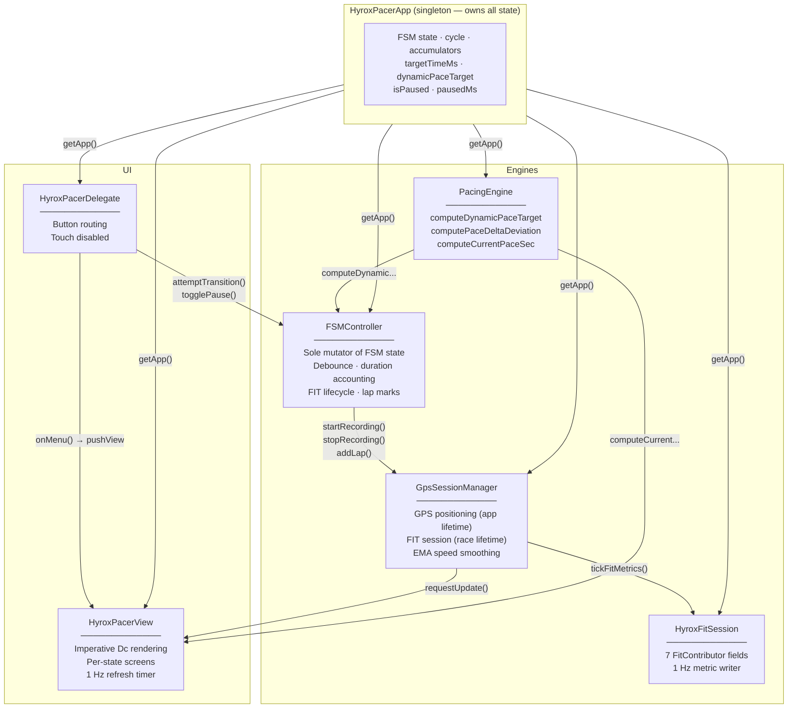
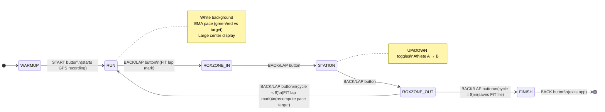
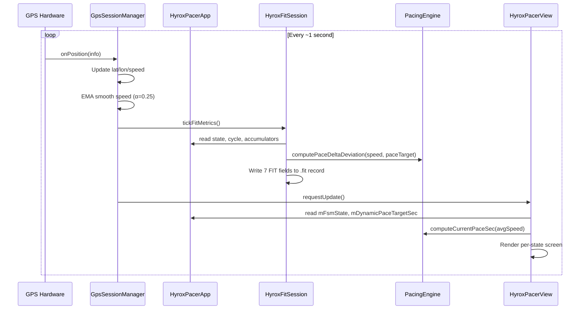

<div align="center">

# HybridPacer

### Intelligent pacing for HYROX on your Garmin watch


**HybridPacer** is an open-source Garmin Connect IQ watch app that guides you through a HYROX race
with real-time adaptive pacing — automatically re-budgeting your target running pace after every station,
so you finish exactly on time.

[Features](#-features) · [Architecture](#-architecture) · [Pacing Engine](#-pacing-engine) · [Build & Install](#-build--install) · [Roadmap](#-roadmap) · [Contributing](#-contributing)

</div>

---

## What is HYROX?

HYROX is a worldwide hybrid fitness race: **8 km of running** broken into 8 rounds of **1 km run → 1 functional workout station**, with short **RoxZone** transition corridors between each run and station.

```
Run 1 km → RoxZone → SkiErg → RoxZone → Run 1 km → RoxZone → Sled Push → RoxZone → … × 8
```

The challenge for pacing: your **total time** includes both running and station time, but you only control your **running pace**. If you go too slow in stations, you must compensate with faster running — and most athletes have no live feedback on whether they are on track.

**HybridPacer solves this.** After every station it recalculates the exact pace you need to run the remaining kilometers to still hit your goal, accounting for all the rest time you've already accumulated.

---

## ✨ Features

- **🎯 Predictive dynamic pacing** — target pace is recalculated on every run entry, projecting future station time based on your actual historical rest averages.
- **📊 EMA-smoothed real pace** — real running pace is displayed using an exponential moving average (α = 0.25) to eliminate GPS noise while staying responsive.
- **🟢🔴 At-a-glance pace coloring** — large central display turns **green** when you are at or ahead of target, **red** when you are falling behind.
- **📂 Full FIT recording with 7 custom developer fields** — syncs to Garmin Connect with charts for cycle, FSM state, RoxZone time, station time, active athlete, pace delta, and work/rest ratio.
- **👯 Doubles / relay mode** — track Athlete A and Athlete B lap times independently during STATION; toggle with UP / DOWN.
- **⏱ Configurable goal time** — choose your target from 40 to 180 minutes (5-minute steps) via an in-app menu; persisted across sessions.
- **⏸ Pause / resume** — freeze the timer and FIT recording with START/STOP mid-race; paused time is excluded from all calculations.
- **🧤 Glove & sweat-proof UI** — all input via physical buttons (touch disabled); no accidental taps during competition.
- **⚡ Zero hot-path allocation** — no `new` calls at 1 Hz; all state pre-allocated at startup for rock-solid memory on constrained hardware.

---

## 🏗 Architecture

HybridPacer is built around a central **App singleton** that owns all race state, accessed globally via `getApp()`. Four engine classes handle distinct responsibilities; the View and Delegate only read state and emit events.



### Key design rules (enforced throughout)

| Rule | Rationale |
|---|---|
| No `new` in hot paths (1 Hz callbacks, render) | Avoids GC pressure on constrained hardware |
| No `switch`/`case` | All state dispatch via `if`/`else if` for Monkey C compatibility |
| No `Lang.Dictionary` as domain structure | Performance and type-safety |
| Typecheck = 3 nullable-narrowing pattern | Copy nullable member to local, null-check before SDK call |
| Single state owner (`HyroxPacerApp`) | One source of truth; engines are stateless mutators |

---

## 🔄 Race State Machine

The FSM is an **immutable linear sequence** — states advance in one direction only (no branching except the cycle loop). `FSMController.attemptTransition()` is the **sole** mutator and applies a 5000 ms debounce between any two transitions.



**Pause** is not a FSM state — it is an App-level flag (`mIsPaused`) that freezes the chronometer, partial timers, and FIT recording within any race state. Paused time is subtracted from all accumulators so totals never inflate.

---

## ⚡ Pacing Engine

The predictive pacing algorithm re-solves for the optimal running pace every time you enter a RUN segment, using the history of your actual station times to project forward.

### Algorithm (`PacingEngine.computeDynamicPaceTarget`)

```
given:
  T_goal      = target total race time (ms)
  T_elapsed   = committed time so far = workMs + restMs (ms)
  k           = cycles completed (= km already run)
  R_total     = total rest time accumulated so far (ms)

derive:
  d_remaining = 8.0 - k                              (km left to run)
  avg_rest    = R_total / k                          (mean rest per past cycle)
  R_projected = avg_rest × (8 - k)                  (projected future rest)
  T_run_left  = T_goal - T_elapsed - R_projected    (ms available for running)

output:
  pace_target = T_run_left / 1000 / d_remaining     (s/km)
```

### Worked example — 90-minute goal

| At entry to RUN… | cycles done | avg rest | projected rest | run time left | **target pace** |
|---|---|---|---|---|---|
| Run 1 (race start) | 0 | 0 s | 0 s | 5400 s | **675 s/km = 11:15/km** |
| Run 4 (after 3 stations of ~3 min each) | 3 | 180 s | 900 s | 3672 s | **734 s/km = 12:14/km** |
| Run 7 (hard session, avg rest 4 min) | 6 | 240 s | 480 s | 1854 s | **927 s/km = 15:27/km** |

> If the computed pace is ≤ 0 (you are already behind your goal), the display shows `--:--` in red — an honest signal to push harder.

For the full derivation and edge cases, see **[docs/PACING-ENGINE.md](docs/PACING-ENGINE.md)**.

---

## 🎮 Button / Control Map

| Button | State | Action |
|---|---|---|
| **START / STOP** | WARMUP | Begin race (WARMUP → RUN) |
| **START / STOP** | RUN / ROXZONE / STATION | Toggle pause / resume |
| **BACK / LAP** | RUN → ROXZONE_IN → STATION → ROXZONE_OUT | Advance FSM (next segment) |
| **BACK / LAP** | WARMUP or FINISH | Exit app |
| **UP** | STATION | Toggle active athlete (A ↔ B) |
| **DOWN** | STATION | Toggle active athlete (A ↔ B) |
| **UP (long press)** | WARMUP | Open target-time menu |

> All touch input (swipe, tap, flick) is intentionally disabled to prevent accidental gestures from sweat or gloves.

---

## 📡 1 Hz Data Flow



---

## 📂 Project Structure

```
HybridPacer/
├── manifest.xml                  # App UUID, type, target devices, permissions
├── monkey.jungle                 # Build config (typecheck=3, optimization=3z)
├── source/
│   ├── HyroxPacerApp.mc          # App singleton — all race state, pause/resume
│   ├── FSMController.mc          # State machine mutator, duration accounting
│   ├── PacingEngine.mc           # Dynamic pace target, pace delta, EMA
│   ├── GpsSessionManager.mc      # GPS positioning + FIT session lifecycle
│   ├── HyroxFitSession.mc        # 7 FitContributor developer fields
│   ├── HyroxPacerView.mc         # Imperative 3-band UI renderer
│   ├── HyroxPacerDelegate.mc     # Button routing (Garmin-native callbacks)
│   └── TargetTimeMenu.mc         # Goal-time preset menu + Storage persistence
└── resources/
    ├── strings/strings.xml       # App name, menu titles, FIT field labels
    ├── drawables/                # Launcher icon (SVG)
    └── fitcontributions.xml      # 7 FIT developer field chart definitions
```

---

## 🔧 Build & Install

### Prerequisites

- [Garmin Connect IQ SDK](https://developer.garmin.com/connect-iq/sdk/) — version compatible with **API Level 4.0.0**
- [VS Code](https://code.visualstudio.com/) + [Monkey C extension](https://marketplace.visualstudio.com/items?itemName=garmin.monkey-c) (recommended)
- A Garmin **developer key** (required for signing; generate one in the VS Code extension)

### Clone

```bash
git clone https://github.com/SoyTiyi/HybridPacer.git
cd HybridPacer
```

### Build (VS Code)

1. Open the project folder in VS Code.
2. Run **"Monkey C: Build Current Project"** from the Command Palette.
3. The signed `.prg` file appears in `bin/`.

### Build (CLI)

```bash
monkeyc \
  -f monkey.jungle \
  -d fr965 \
  -o bin/HybridPacer.prg \
  -y /path/to/developer_key.der \
  --typecheck 3
```

### Run in simulator

```bash
monkeydo bin/HybridPacer.prg fr965
```

### Deploy to watch

Copy `bin/HybridPacer.prg` to `GARMIN/APPS/` on your fr965 via USB or use the **"Monkey C: Run on Device"** command in VS Code.

### Adding more devices

Edit `manifest.xml` and add `<iq:product id="DEVICE_ID"/>` inside `<iq:products>`. The device ID can be found in the [Connect IQ Device List](https://developer.garmin.com/connect-iq/compatible-devices/). Test carefully — screen dimensions and font availability vary by device.

> **Note on naming:** The in-app manifest name is still `HyroxPacer` (the original project name). The GitHub repository and documentation use **HybridPacer** as the canonical brand. A manifest rename is planned for a future release.

---

## 📈 Roadmap

| Phase | Status | What was built |
|---|---|---|
| **Phase 1** | ✅ Done | App scaffold, FSM constants, singleton pattern |
| **Phase 2** | ✅ Done | Full state machine, 5s debounce, doubles/relay mode |
| **Phase 3** | ✅ Done | FIT recording, 7 FitContributor developer fields |
| **Phase 4** | ✅ Done | Predictive pacing engine (`computeDynamicPaceTarget`) |
| **Phase 5** | ✅ Done | Imperative 3-band UI (no layout.xml), per-state screens |
| **Phase 6** | ✅ Done | Configurable goal time (40–180 min), Menu2 + Storage persistence |
| **Phase 7** | ✅ Done | Pause / resume (START/STOP), EMA-smoothed real pace display |

**Candidate future work** (not yet scheduled):
- Additional device support (Fenix 7, Epix, Forerunner 255, etc.)
- Named HYROX stations (SkiErg, Sled Push, Sled Pull, …) with per-station stats
- Expose goal time via `settings.xml` (Connect IQ settings system)
- Post-race summary screen with per-km splits
- Localization (i18n string resources)

See **[ROADMAP.md](ROADMAP.md)** for the full backlog.

---

## 🤝 Contributing

Contributions are welcome! Please read **[CONTRIBUTING.md](CONTRIBUTING.md)** before opening a PR — it covers the Monkey C coding conventions this project enforces (no hot-path allocation, no `switch`, nullable-narrowing patterns, English-only comments/strings) and how to run the build and simulator tests.

For bugs and feature ideas, use the [GitHub issue templates](.github/ISSUE_TEMPLATE/).

---

## 📄 License

MIT © 2026 [SoyTiyi](https://github.com/SoyTiyi) — see [LICENSE](LICENSE).

---

## 🙏 Acknowledgements

- [Garmin Connect IQ SDK](https://developer.garmin.com/connect-iq/) and the Monkey C language.
- The HYROX community for pushing the boundaries of hybrid fitness racing.
- All athletes who provided feedback during testing.
