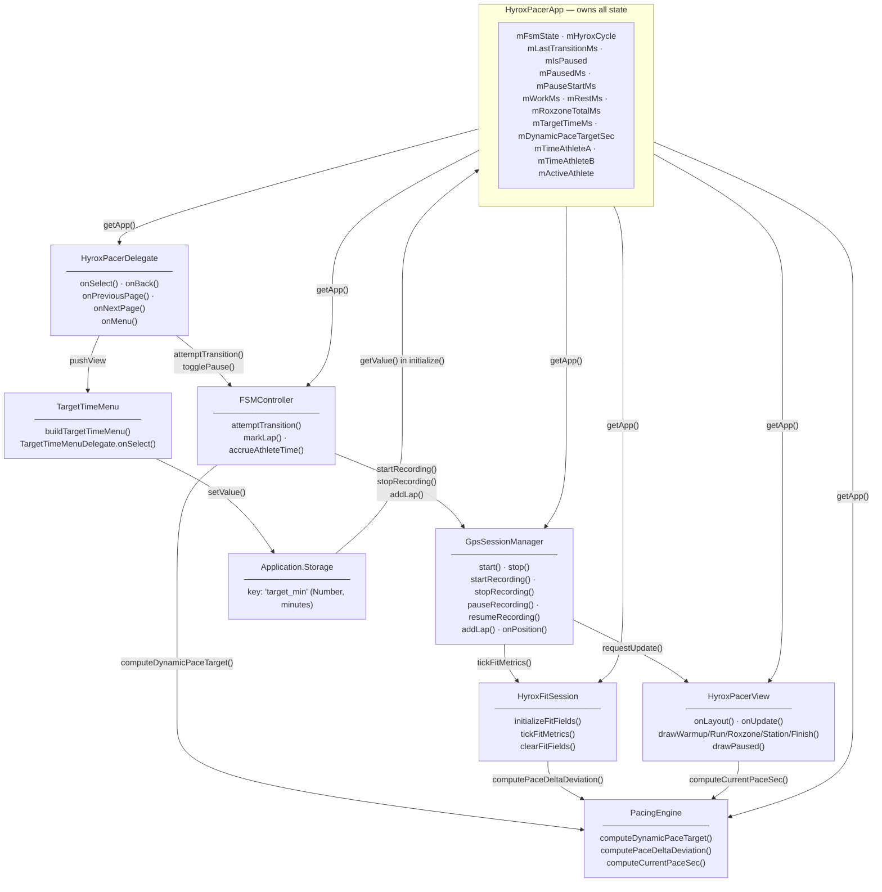
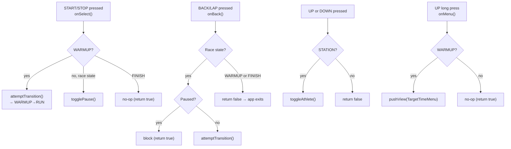
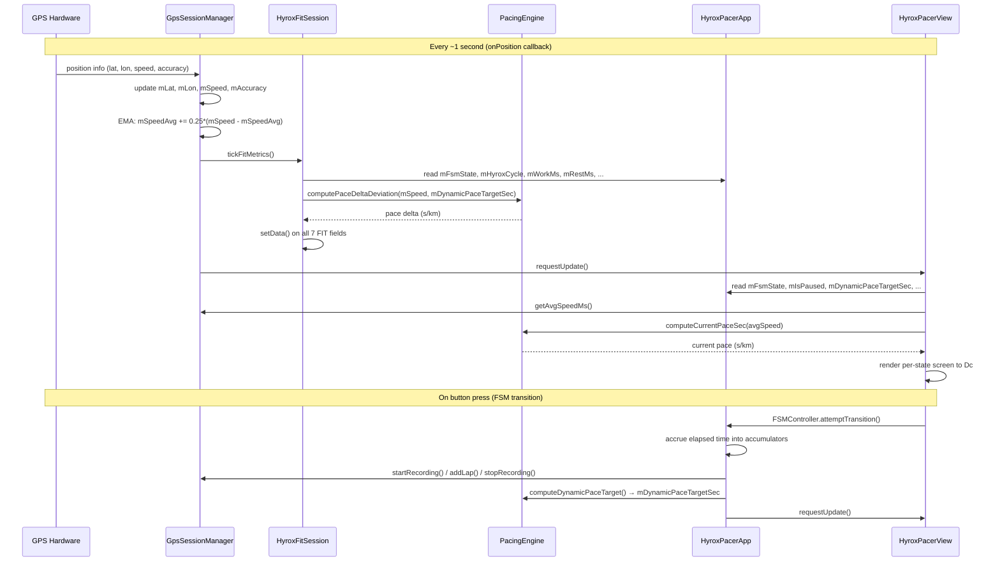

# HybridPacer — Architecture

This document describes every component in HybridPacer, the data flow between them, and the key design decisions that constrain how the code is written.

---

## Table of Contents

1. [Overview](#overview)
2. [Component Map](#component-map)
3. [App Singleton — HyroxPacerApp](#app-singleton--hyroxpacerapp)
4. [State Machine — FSMController](#state-machine--fsmcontroller)
5. [GPS & FIT Session — GpsSessionManager](#gps--fit-session--gpssessionmanager)
6. [FIT Fields — HyroxFitSession](#fit-fields--hyroxfitsession)
7. [Pacing Engine — PacingEngine](#pacing-engine--pacingengine)
8. [UI — HyroxPacerView](#ui--hyroxpacerview)
9. [Input — HyroxPacerDelegate](#input--hyroxpacerdelegate)
10. [Configuration — TargetTimeMenu](#configuration--targettimemenu)
11. [Design Rules](#design-rules)
12. [Data Flow Diagram](#data-flow-diagram)

---

## Overview

HybridPacer is a **Garmin Connect IQ watch app** (Monkey C, API Level 4.0.0) targeting the Forerunner 965. It guides an athlete through a HYROX race — 8 × (1 km run + functional workout station) — with:

- A **predictive pacing engine** that re-budgets target running pace after every station.
- **FIT recording** with 7 custom developer fields that surface as charts in Garmin Connect.
- A **doubles/relay mode** that tracks per-athlete time independently.
- **Pause/resume** that freezes chronometers and FIT recording without losing data.

The architecture follows a strict **single-owner, stateless-engine** pattern: all race state lives in one singleton (`HyroxPacerApp`), accessed globally via `getApp()`. Engine classes are stateless mutators.

---

## Component Map



---

## App Singleton — HyroxPacerApp

**File:** `source/HyroxPacerApp.mc`

The application entry point and the **single source of truth** for all race state. Every engine class reaches it through the module-level `getApp()` function.

### State members (all pre-assigned in `initialize()`)

| Member | Type | Description |
|---|---|---|
| `mFsmState` | `Number` | Current FSM state (0–5) |
| `mLastTransitionMs` | `Number` | `System.getTimer()` at last successful transition — base for 5s debounce |
| `mHyroxCycle` | `Number` | Completed cycles (0–7); equals km already run |
| `mActiveAthlete` | `Boolean` | `true` = Athlete A active; `false` = Athlete B (doubles mode) |
| `mIsPaused` | `Boolean` | `true` while race is paused |
| `mPauseStartMs` | `Number` | Timer value when current pause began |
| `mPausedMs` | `Number` | Paused ms accumulated **within the current state** (reset to 0 on each transition) |
| `mWorkMs` | `Number` | Total ms spent in STATE_RUN |
| `mRestMs` | `Number` | Total ms in ROXZONE_IN + STATION + ROXZONE_OUT |
| `mRoxzoneTotalMs` | `Number` | Total ms in ROXZONE_IN + ROXZONE_OUT only |
| `mTargetTimeMs` | `Number` | Goal race time in ms (loaded from Storage) |
| `mTimeAthleteA` | `Number` | Cumulative ms for Athlete A (doubles) |
| `mTimeAthleteB` | `Number` | Cumulative ms for Athlete B (doubles) |
| `mDynamicPaceTargetSec` | `Float` | Current target pace in s/km (updated by FSMController on RUN entry) |

### Key methods

- **`initialize()`** — Instantiates all four engines (`new` permitted here — startup only). Loads target time from `Storage` with type-check, clamp [40, 180], and fallback to 90 minutes.
- **`onStart(state)`** — Calls `mGps.start()` to enable continuous GPS positioning.
- **`onStop(state)`** — Calls `mGps.stop()` (safety-net FIT save + GPS release).
- **`togglePause()`** — Toggles `mIsPaused` in race states (RUN..ROXZONE_OUT). Accumulates paused time into `mPausedMs` on resume; calls `mGps.pauseRecording()` or `mGps.resumeRecording()`.
- **`getInitialView()`** — Returns `[HyroxPacerView, HyroxPacerDelegate]`.

### Global accessor

```monkey-c
function getApp() as HyroxPacerApp {
    return Application.getApp() as HyroxPacerApp;
}
```

This is defined at module scope (not inside any class). Every engine and view calls `getApp()` to read or write app state.

---

## State Machine — FSMController

**File:** `source/FSMController.mc`

The **sole mutator** of `mFsmState`, `mHyroxCycle`, `mLastTransitionMs`, `mWorkMs`, `mRestMs`, and `mRoxzoneTotalMs`. Has no state of its own.

### FSM topology

```mermaid
stateDiagram-v2
    direction LR
    [*] --> WARMUP: app launch

    WARMUP --> RUN: attemptTransition()\nstartRecording()

    RUN --> ROXZONE_IN: attemptTransition()\nmarkLap()

    ROXZONE_IN --> STATION: attemptTransition()

    STATION --> ROXZONE_OUT: attemptTransition()

    ROXZONE_OUT --> RUN: cycle < 8\nattemptTransition()\nmarkLap()\nrecomputePaceTarget()

    ROXZONE_OUT --> FINISH: cycle = 8\nattemptTransition()\nstopRecording()

    FINISH --> [*]: onBack() returns false\n(runtime closes app)
```



### `attemptTransition()` — step by step

1. **Terminal guard** — if `state >= STATE_FINISH`, return immediately.
2. **5-second debounce** — if `now - mLastTransitionMs < 5000`, silently discard.
3. **Duration accounting** (skipped for WARMUP, whose pre-race time is not counted):
   - `elapsed = now - mLastTransitionMs - mPausedMs`
   - Routes `elapsed` into `mWorkMs` (RUN), `mRestMs + mRoxzoneTotalMs` (ROXZONE_IN/OUT), or `mRestMs` (STATION).
   - Calls `accrueAthleteTime(app, elapsed)` to credit the active athlete.
4. **Transition logic**:
   - `ROXZONE_OUT → RUN` or `FINISH`: increment `mHyroxCycle`. If `>= 8` → stop recording + `FINISH`. Else → `markLap()` + `RUN` + recompute pace target.
   - All others: linear `state + 1`. On `WARMUP → RUN`: `startRecording()`. On `RUN → ROXZONE_IN`: `markLap()`.
5. **Seal**: stamp `mLastTransitionMs = now`, reset `mPausedMs = 0`, `WatchUi.requestUpdate()`.

### FIT split boundaries

Lap marks (`session.addLap()`) are emitted at exactly two boundaries:
- **RUN → ROXZONE_IN** — the athlete leaves the run and enters the transition corridor.
- **ROXZONE_OUT → RUN** — the athlete completes the station and returns to running.

---

## GPS & FIT Session — GpsSessionManager

**File:** `source/GpsSessionManager.mc`

Encapsulates two SDK lifecycles with different lifetimes:

| Lifecycle | Start | End |
|---|---|---|
| **GPS Positioning** | `App.onStart()` → `start()` | `App.onStop()` → `stop()` |
| **FIT Session** | WARMUP→RUN → `startRecording()` | FINISH → `stopRecording()` |

### EMA speed smoothing

```
mSpeedAvg += 0.25 × (mSpeed − mSpeedAvg)    // α = 0.25, ~4 s time constant at 1 Hz
```

Applied in `onPosition()` at every GPS callback. The smoothed value (`getAvgSpeedMs()`) is used for the on-screen pace display; the raw value (`getSpeedMs()`) is used for FIT field `pace_delta_deviation`.

### Pause / resume (Phase 7)

`pauseRecording()` calls `session.stop()` — pauses the FIT timer without saving. `resumeRecording()` calls `session.start()` on the same session object. `save()` is always deferred to `stopRecording()` at FINISH (or `stop()` on forced exit), so the `.fit` file is never lost mid-race.

### Nullable pattern (typecheck=3)

`mSession` is declared `ActivityRecording.Session? = null`. All SDK calls use:

```monkey-c
var s = mSession;
if (s != null) {
    s.start();   // compiler narrows s to Session here
}
```

---

## FIT Fields — HyroxFitSession

**File:** `source/HyroxFitSession.mc`

Owns the 7 `FitContributor.Field` handles. Written at ~1 Hz by `tickFitMetrics()`, called from `GpsSessionManager.onPosition()`.

### Field registry

| ID | Constant | Field name | Type | Unit | Chart |
|---|---|---|---|---|---|
| 0 | `FIT_ID_CYCLE_ID` | `hyrox_cycle_id` | UINT8 | cycle | Yes |
| 1 | `FIT_ID_FSM_STATE` | `hyrox_fsm_state` | UINT8 | state | Yes |
| 2 | `FIT_ID_ROXZONE_TOTAL` | `roxzone_total_time` | UINT32 | s | Yes |
| 3 | `FIT_ID_STATION_ELAPSED` | `station_elapsed` | UINT32 | s | Yes |
| 4 | `FIT_ID_ACTIVE_ATHLETE` | `active_athlete` | UINT8 | bool | No |
| 5 | `FIT_ID_PACE_DELTA` | `pace_delta_deviation` | FLOAT | s/km | Yes |
| 6 | `FIT_ID_WORK_REST` | `work_rest_ratio` | FLOAT | ratio | Yes |

The IDs **must match** the `id` attributes in `resources/fitcontributions.xml`.

### Fast-path guard

`mIsInitialized` is `false` until `initializeFitFields()` completes and becomes `false` again after `clearFitFields()`. The first line of `tickFitMetrics()` returns immediately if `!mIsInitialized`, making the 1 Hz callback essentially free before the FIT session starts.

### Nullable field pattern

All 7 field handles are declared `FitContributor.Field? = null`. `tickFitMetrics()` uses the same local-copy narrowing pattern:

```monkey-c
var f = mFieldCycleId;
if (f != null) {
    f.setData(app.mHyroxCycle);
}
```

---

## Pacing Engine — PacingEngine

**File:** `source/PacingEngine.mc`

A stateless class with three pure functions. No `Toybox.Math` — all arithmetic is scalar integer/float operations. See **[docs/PACING-ENGINE.md](PACING-ENGINE.md)** for the full derivation and worked examples.

| Method | When called | Returns |
|---|---|---|
| `computeDynamicPaceTarget(targetTimeMs, elapsedTotalMs, distanceKm)` | FSMController on every RUN entry | Target pace (s/km), or 0.0f if off-plan |
| `computePaceDeltaDeviation(speedMps, paceTargetSec)` | HyroxFitSession.tickFitMetrics() at 1 Hz | Deviation (s/km), positive = slower |
| `computeCurrentPaceSec(speedMps)` | HyroxPacerView.drawRun() at 1 Hz | Current pace (s/km), or 0.0f if stopped |

---

## UI — HyroxPacerView

**File:** `source/HyroxPacerView.mc`

Fully imperative rendering — no `layout.xml`. All drawing uses `Dc` primitives.

### Three-band layout

```
┌─────────────────────────┐
│  HEADER  (top ~25%)     │  State label + cycle counter
│                         │
│  CENTER  (middle ~50%)  │  Primary metric (pace, timer, total time)
│                         │
│  FOOTER  (bottom ~25%)  │  Secondary info / button hint / athlete
└─────────────────────────┘
```

Dimensions are pre-computed once in `onLayout()` (`mCenterX`, `mCenterY`, `mBandTopY`, `mBandBottomY`, `mLineH`) and reused in every `onUpdate()` call — no division in the hot path.

### Per-state screen content

| State | Background | Center display | Footer |
|---|---|---|---|
| WARMUP | Black | Goal time (large) | GPS status · "START > begin" |
| RUN | **White** | EMA pace (green/red) | km partial |
| ROXZONE_IN / OUT | Black | Transition timer (yellow) | "BACK > continue" |
| STATION | Black | Station timer | Active athlete (blue A / orange B) |
| FINISH | Black | Total time | W/R ratio · "BACK > exit" |
| **PAUSED** | Dark gray | "PAUSED" (red) | Frozen partial · "START > resume" |

### 1 Hz refresh timer

A `Timer.Timer` is created in `onShow()` and calls `requestUpdate()` every 1000 ms. This ensures partial timers advance even when the GPS is not reporting new positions (e.g., indoors, during stations). The timer is stopped in `onHide()`.

---

## Input — HyroxPacerDelegate

**File:** `source/HyroxPacerDelegate.mc`

Extends `WatchUi.BehaviorDelegate`. Uses **behavior callbacks only** — does not override `onKey()`.

> **Why not `onKey()`?** `BehaviorDelegate.onKey()` is the internal key-to-behavior router. Overriding it without calling `super` silently breaks `onSelect()`, `onBack()`, `onPreviousPage()`, and `onNextPage()`. The documented and reliable pattern is to implement the behavior callbacks instead.

Touch is fully disabled — `onSwipe`, `onTap`, `onFlick` all return `true` (consume and discard).

### Button routing



---

## Configuration — TargetTimeMenu

**File:** `source/TargetTimeMenu.mc`

`buildTargetTimeMenu(currentMinutes)` builds a `WatchUi.Menu2` with presets from 40 to 180 minutes (step 5), focused on the currently configured value.

`TargetTimeMenuDelegate.onSelect(item)` reads the minute value from `item.getId()`, sets `mTargetTimeMs = minutes * 60000` on the app, persists with `Storage.setValue("target_min", minutes)`, and pops the view.

The menu is only accessible via `onMenu()` (long-press UP) in WARMUP. Changing the target mid-race would invalidate the pacing projection.

---

## Design Rules

| Rule | Where enforced | Rationale |
|---|---|---|
| No `new` in hot paths | `onPosition()`, `onUpdate()`, `tickFitMetrics()` | Prevents GC pauses on constrained VM |
| No `switch`/`case` | All files | Consistency; avoids edge cases with Monkey C switch semantics |
| No `Lang.Dictionary` as domain structure | All files | Performance; breaks typecheck=3 narrowing |
| Typecheck=3 nullable-narrowing | All nullable SDK types | Catches null-dereference at compile time |
| Single state owner (`HyroxPacerApp`) | All files | One source of truth; engines are stateless |
| `FSMController` is sole FSM mutator | All files | Centralizes all state transitions and side effects |
| English-only comments and UI strings | All files | Global project |

---

## Data Flow Diagram


